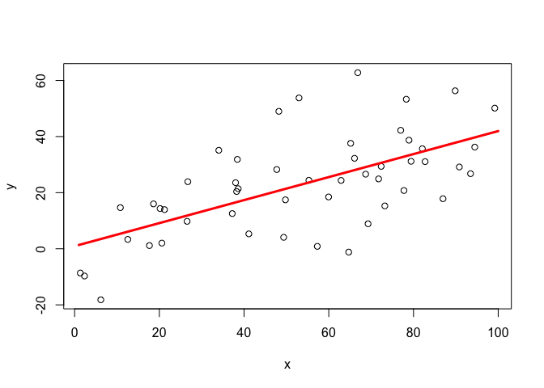
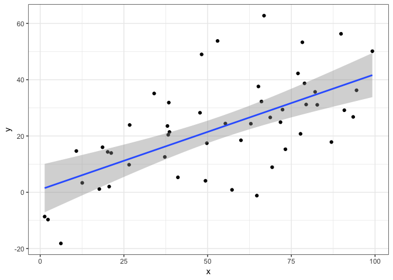

Activity Eleven - Biostatistics1
================
Taehoon Ha
11/21/2018

-   [Question 1](#question-1)
-   [Question 2](#question-2)
-   [Question 3](#question-3)
-   [Question 4](#question-4)

### Question 1

Write a function that generates numbers from *B**i**n**o**m**i**a**l*(*n*, *p*) distribution using `runif()` function. + Hint: *B**i**n**o**m**i**a**l*(*n*, *p*) random variable can be defined as a sum of n independent *B**e**r**n**o**u**l**l**i*(*p*) random variables.

``` r
q1 <- function(n, p) {
    random.binomial <- c()
    for (i in 1:n) {
        random.uniform <- runif(n, 0, 1)
        random.bernoulli <- as.numeric(random.uniform < p)
        random.binomial[i] <- sum(random.bernoulli)
    }
    return(random.binomial)
}
```

<br><br>

### Question 2

Compare performance of your function with `rbinom()` using `microbenchmark()` function.

``` r
microbenchmark(rbinom(n = 100, size = 100, p = 0.25),
               q1(n = 100, p = 0.25),
               times = 100)
```

    ## Unit: microseconds
    ##                                   expr     min       lq      mean   median
    ##  rbinom(n = 100, size = 100, p = 0.25)   8.912  10.5255  12.81732  11.4565
    ##                  q1(n = 100, p = 0.25) 610.253 751.4435 997.55140 771.2655
    ##        uq      max neval
    ##   12.1185   115.24   100
    ##  813.2495 20596.12   100

<br><br>

### Question 3

Suppose we want to simulate data from a linear regression model:

<p align="center">

</p>
<br>

Let *β*<sub>0</sub>=15 and *β*<sub>1</sub> = 0.4 are known coefficients. Generate data (*N* = 50) from this models with given coefficients. Fit a linear regression model and plot fitted values vs. residuals using `ggplot()` function. Please do not forget to use `set.seed()` function for reproductibility.

``` r
set.seed(1)

# using base plot function
x <- runif(50, 0, 100)
y <- 0.4 * x + rnorm(50, 0, 15)
df <- data.frame(x, y)
mod <- lm(y ~ x, data = df)
x_new <- 1:100
pred <- predict(mod, newdata=data.frame(x = x_new))
plot(df)
lines(x_new, pred, lwd = 3, col = 2)
```



``` r
# using ggplot function
ggplot(df, aes(x, y)) +
    geom_point() +
    geom_smooth(method='lm') +
    theme_bw()
```



<br><br>

### Question 4

Box-Muller algorithm: generate *U*<sub>1</sub> and *U*<sub>2</sub> two independent uniform (0, 1) random variables and set:

<p align="center">

</p>
<br>

are two independent normal variables. Write a function that generates normal variates using Box-Muller algorithm. Compare simulated data from your function with simulated data from `rnorm()` function using `ggplot()` (histogram?).

``` r
newrnorm <- function (n) 
    {
        u1 <- runif(n/2, 0, 1)
        u2 <- runif(n/2, 0, 1)
        theta <- 2 * pi * u2
        R <- sqrt(-2 * log10(u1))
        x <- R * cos(theta)
        y <- R * sin(theta)
        vec <- c(x, y)
        vec
}

x <- seq(-2, 2, length.out = 5000)
y1 <- newrnorm(5000) 
y2 <- rnorm(5000)
Y <- data.frame(y1, y2)

ggplot(data=Y, aes(x= y1, fill = "red")) + 
    geom_histogram(alpha = 0.3) + 
    geom_histogram(aes(x= y2, fill = "blue"), alpha = 0.3) +
    labs(x="X", y="Frequency", title = "Comparison between Box-Muller algorithm and Normal distribution ") +
    scale_fill_discrete(name = "Method", labels=c("Box-Muller Algorithm","Normal Distribution")) +
    theme_bw()
```

    ## `stat_bin()` using `bins = 30`. Pick better value with `binwidth`.
    ## `stat_bin()` using `bins = 30`. Pick better value with `binwidth`.


