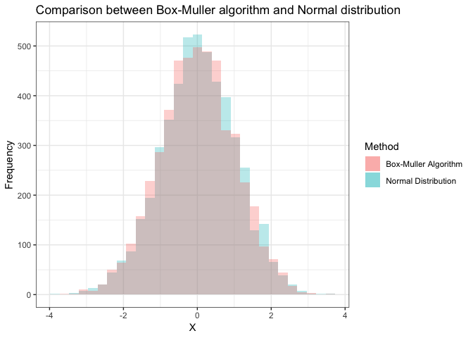

Assignment Eleven - Biostatistics1
================
Taehoon Ha
11/23/2018

-   [1. Create a GitHub repository Lab11](#1-create-a-github-repository-lab11)
-   [2. Submit your code for all problems from **Activity11**.](#2-submit-your-code-for-all-problems-from-activity11)
    -   [Question 1](#question-1)
    -   [Question 2](#question-2)
    -   [Question 3](#question-3)
    -   [Question 4](#question-4)
-   [3. Please make sure your code is formatted according to the style guide.](#3-please-make-sure-your-code-is-formatted-according-to-the-style-guide)

### 1. Create a GitHub repository Lab11

<br><br>

### 2. Submit your code for all problems from **Activity11**.

<br>

#### Question 1

Write a function that generates numbers from *B*(*n*, *p*) distribution using `runif()` function.

-   Hint: *B*(*n*, *p*) random variable can be defined as a sum of n independent *Bernoulli(p)* random variables.

``` r
q1 <- function(n, size, p) {
    random.binomial <- c()
    for (i in 1:n) {
        random.uniform <- runif(size, 0, 1)
        random.bernoulli <- as.numeric(random.uniform < p)
        random.binomial[i] <- sum(random.bernoulli)
    }
    return(random.binomial)
}
```

<br>

#### Question 2

Compare performance of your function with `rbinom()` using `microbenchmark()` function.

``` r
microbenchmark(rbinom(n = 100, size = 100, p = 0.25),
               q1(n = 100, size = 100, p = 0.25),
               times = 100)
```

    ## Unit: microseconds
    ##                                   expr     min      lq      mean  median
    ##  rbinom(n = 100, size = 100, p = 0.25)   9.012   9.864  12.04889  11.094
    ##      q1(n = 100, size = 100, p = 0.25) 629.118 721.588 956.54732 732.653
    ##        uq      max neval
    ##   11.9945    60.48   100
    ##  772.1270 19576.61   100

<br>

#### Question 3

Suppose we want to simulate data from a linear regression model:

<p align="center">

</p>
<br>

Let *β*<sub>0</sub>=15 and *β*<sub>1</sub> = 0.4 are known coefficients. Generate data (*N* = 50) from this models with given coefficients. Fit a linear regression model and plot fitted values vs. residuals using `ggplot()` function. Please do not forget to use `set.seed()` function for reproductibility.

``` r
set.seed(1)

x <- runif(50, 20, 40)
y <- 15 + 0.4 * x + rnorm(50, 0, 3)
df <- data.frame(x, y)
mod <- lm(y ~ x, data = df)

# using ggplot function
ggplot(mod, aes(.fitted, .resid)) + 
    geom_point() + 
    stat_smooth(method = "auto", se = F, col = 'red') + 
    geom_hline(yintercept = 0, linetype = "dashed") + 
    xlab("Fitted values") + 
    ylab("Residuals") + 
    ggtitle("Residual vs Fitted Plot") +
    theme_bw() + 
    theme(plot.title = element_text(hjust = 0.5, size = 18, face = "bold"))
```

    ## `geom_smooth()` using method = 'loess' and formula 'y ~ x'


<br>

#### Question 4

Box-Muller algorithm: generate *U*<sub>1</sub> and *U*<sub>2</sub> two independent uniform (0, 1) random variables and set:

<p align="center">

</p>
<br>

are two independent normal variables. Write a function that generates normal variates using Box-Muller algorithm. Compare simulated data from your function with simulated data from `rnorm()` function using `ggplot()` (histogram?).

``` r
newrnorm <- function(n) {
    u1 <- runif(n/2, 0, 1)
    u2 <- runif(n/2, 0, 1)
    
    theta <- 2 * pi * u2
    R <- sqrt(-2 * log10(u1))
    
    x <- R * cos(theta)
    y <- R * sin(theta)
    
    vec <- c(x, y)
    vec
}

x <- seq(-2, 2, length.out = 5000)
y1 <- newrnorm(5000)
y2 <- rnorm(5000)
Y <- data.frame(y1, y2)

# using ggplot
ggplot(data = Y, aes(x = y1, fill = "red")) +
    geom_histogram(alpha = 0.3) + 
    geom_histogram(aes(x = y2, fill = "blue"), alpha = 0.3) +
    labs(x = "X", 
         y = "Frequency", 
         title = "Comparison between Box-Muller algorithm and Normal distribution") + 
    scale_fill_discrete(name = "Method", 
                        labels = c("Box-Muller Algorithm", "Normal Distribution")) +
    theme_bw()
```

    ## `stat_bin()` using `bins = 30`. Pick better value with `binwidth`.
    ## `stat_bin()` using `bins = 30`. Pick better value with `binwidth`.



<br><br>

### 3. Please make sure your code is formatted according to the style guide.
